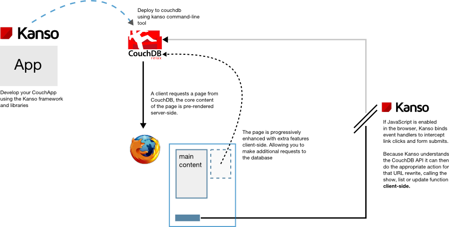

# How Kanso Processes Requests

Kanso makes it easy to re-use code between the client and server wherever
possible, but to be used effectively you must understand how requests are
processed.

1. The browser makes a request to <code>/foo</code>
2. CouchDB looks up the show / list / update function that <code>/foo</code>
   rewrites to.
3. This function is executed server-side by CouchDB, rendering a HTML page
   containing the document or view.
4. The browser receives the pre-rendered version of the page from CouchDB.
   If JavaScript is not enabled, the process stops here until a link is
   clicked or a form is submitted, causing a new request to the CouchDB server.
5. If JavaScript is enabled, Kanso looks up the show / list / update function
   for <code>/foo</code> and executes it again, client-side. This allows the
   application developer to enhance the page by making additional requests and
   generally doing things CouchDB wouldn't normally allow.
6. Kanso binds event handlers for every form submit and link click
   (even ones yet to exist). If the target URL is part of your app, Kanso
   will look up the new show / list / update function and execute it client-side
   without a round-trip to the server (apart from fetching relevent documents
   or views).
